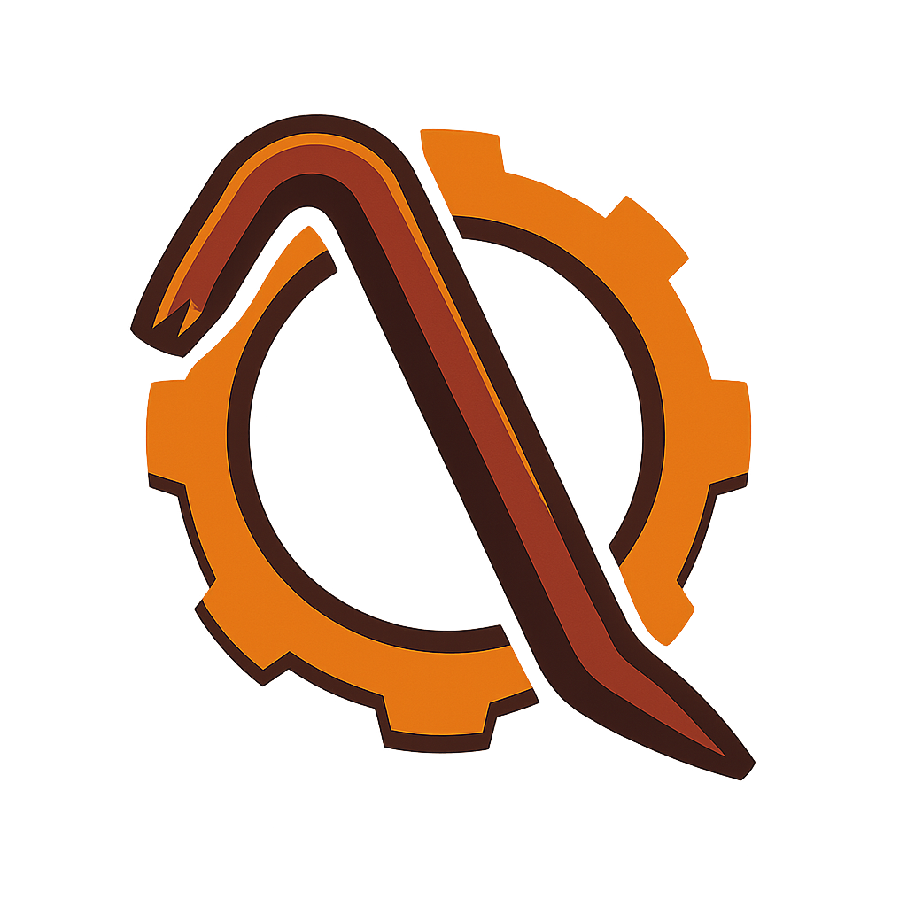

  

  
  
  

<h3 align="center">🛠️ Crowbar</h3>

  <b>The open-source crowbar for Steam data!</b> 
  <i>Break open the Steam Community and get real-time info on games, users, inventories, and more.</i>

  <b>Made with ❤️ by the Crowbar community</b>

